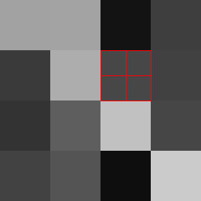

# downhill
This repository contains an implementation of an algorithm for randomly generating terrain that has a downhill path from any point to the edge of the map. We call this the **downhill property**. This property is useful for generating realistic rivers. It is common for other terrain generation algorithms end up with 'bowls' in the landscape that make it difficult to add realistic rivers.   

## The Algorithm

Let's say we already have a terrain that already satisfies the downhill property:

You are looking a terrain with 64 'cells' arranged in a 4x4 grid heightmap. The lighter the cell, the higher it's altitude. This terrain satisfies the downhill property (when paths to the edge of the map can be created by moving up, down, left and right but not diagonally). 

We can split this into an 8x8 terrain while preserving the downhill property. Each cell is divided into four 'child' cells, e.g.:

In order to preserve the downhill property, we need to make sure that each new cell has at least one neighbour that is lower (or is at the edge of the map). 

Each new cell will have four neighbours. Two of these neighbours will the same parent cell, and two will have different parent cells - we call their parents the **neighbouring parent cells**.

There are three cases for new cells:
1. Both neighbouring parent cells are *lower* than the parent cell.
2. One neighbouring parent cell is lower than the parent cell and the other is higher.
3. Both neighbouring parent cells are *higher* than the parent cell.

In cases 1 and 2, we constrain the height of the new cell as follows:  
1. It must be lower than its parent cell.
2. It must be higher than the lower of its parent cells and the two neighbouring parent cells.

This ensures that at least one of the neighbours with a different parent will be lower. 

In case 3 we make the height of the new cell the same height as its parent. In this case it is not as obvious how there will be a downhill route. Clearly the neighbours with different parents will both be higher. 

However, one of the neighbours with the same parent will be lower. This is because at least one of these will be case 1 or case 2 cell (all the children of a cell cannot be case 3, this would mean the original terrain did not satisfy the downhill property). Since these cells are case 1 or 2, they must be lower than the parent cell, which means they are lower than the case 3 cell.

Let us split our 4x4 terrain with these constraints (we set the height of case 1 or case 2 cells to random values between the minimum and maximum value):    
  

We can repeat this process indefinitely:

    
  
# Implementation

The implementation is designed to minimise Java memory usage and garbage collection. 
1. The only part of the mesh held in memory are the x, y and z (elevation) coordinates of each point. We can work out where the edges and triangles are as the mesh has a predictable pattern.  
2. Where possible (and practical) a single copy of an object is mutated instead of creating a new object. In particular, the EdgeIterator and TriangleIterator that iterate over the edges or triangles of a mesh repeatedly return the same object with changed values. 