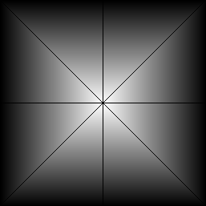
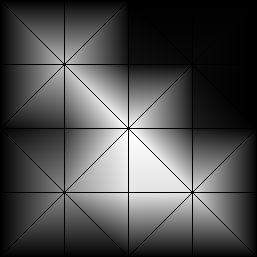
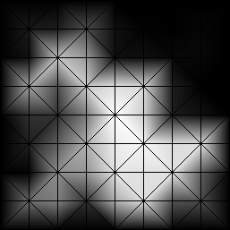
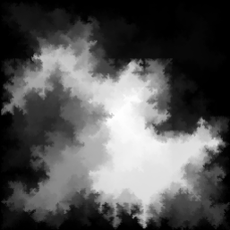
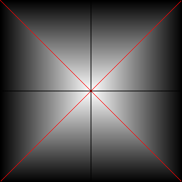
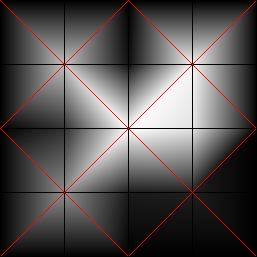
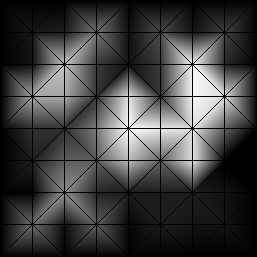
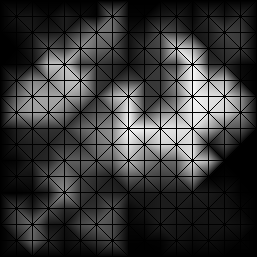
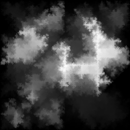

# downhill
This repository contains an implementation of an algorithm for randomly generating terrain that has a downhill path from any point to the edge of the map. This property is useful for generating realistic rivers. It is common for other terrain generation algorithms end up with 'bowls' in the landscape that make it difficult to add realistic rivers.   

## The Algorithm

The algorithm works by repeatedly dividing triangles into four small triangles.

We start with a simple mesh featuring 9 vertices, 16 edges and 8 triangles.

The shading shows the elevation of each point. The elevations are interpolated from the elevation of each vertex. The black lines show the edges of the triangles. This terrain is a pyramid, there is clearly a path from any point to the edge of the map.  

We now create new vertices at the midpoint of each edge and use them to create new triangles. The elevation of each new vertex must be between the elevation at each end of the edge. This ensures there is still a path from each vertex to the edge of the map.

If we repeat this process we start to get a nice random terrain that guarantees a route from each path to the edge.

This is however a bit boring - if you follow a path uphill from the edge of the map, you always get to the peak in the centre. Wouldn't it be better if there were sub-peaks?

To achieve this we take advantage of the way the diagonal edges split.

In the split mesh, the vertex in the middle of each diagonal edge is connected to the four corners of the 'box' around it - which are points that were present in the original mesh. 

We can change the rule for getting the minimum elevation of these vertices - they only need to be higher than one of the four corners and we can guarantee that there is a route to the edge of the map. Let's look at what happens when we split with this new rule.

In the top left we see how this allows 'valleys' to grow in from the edge of the map, which ultimately separate two areas of higher terrain. Now we have sub-peaks!

### Rivers

The motivation for this algorithm was to generate realistic rivers. So let's see what rivers look like on this terrain. To generate rivers we:

1. Assume rainfall is distributed evenly across the terrain. The rainfall hitting each triangle is its area 'when viewed from above' (projected onto the x-y plane).
2. Place the rainfall for each triangle onto its lowest vertex (slightly unrealistic but good enough).
3. Take the rainfall downhill to the next vertex and repeat until the edge of the map is reached.

# Implementation

The implementation is designed to minimise Java memory usage and garbage collection. 
1. The only part of the mesh held in memory are the x, y and z (elevation) coordinates of each point. We can work out where the edges and triangles are as the mesh has a predictable pattern.  
2. Where possible (and practical) a single copy of an object is mutated instead of creating a new object. In particular, the EdgeIterator and TriangleIterator that iterate over the edges or triangles of a mesh repeatedly return the same object with changed values. 