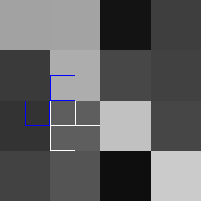

# downhill
This repository contains an implementation of an algorithm for randomly generating terrain that has a downhill path from any point to the edge of the map. We call this the **downhill property**. This property is useful for generating realistic rivers. It is common for other terrain generation algorithms to end up with 'bowls' in the landscape that make it difficult to add realistic rivers.   

## The Algorithm

Let's say we already have a simple terrain that already satisfies the downhill property:

You are looking a heightmap of a terrain with 64 **cells** arranged in a 4x4 grid. The lighter the cell, the higher its altitude. This terrain satisfies the downhill property (allowing for up-down-left-right, but not diagonal, movement). 

We can split this into an 8x8 terrain while preserving the downhill property. Each cell is divided into four new cells, as shown below.

Let us consider just one cell and the cell it splits from (referred to as its **parent cell**).

 

The cell will have four neighbours.  

The two white neighbours have the same parent cell and the two blue neighbours have different parent cells. We call the parents of the blue cells the **neighbouring parent cells**.

### Preserving the downhill property

In order to preserve the downhill property in our 8x8 terrain, we need to make sure that each new cell has at least one neighbour that is lower (or is at the edge of the map). We do this by constraining the height of new cells. Our first constraint applies to all new cells: 

**Constraint 1:** New cells may be no higher than their parent cells. 

 Further constraints depend on the *type* of the new cell. There are three types. The parent cell we highlighted earlier features all three types:
* **Type-- (Red)** Both neighbouring parent cells are *lower* than the parent cell.
* **Type++ (Yellow)** Both neighbouring parent cells are *higher* than the parent cell.
* **Type+- (Orange)** One lower, one higher.

Let us look at how we constrain each type of cell and how this ensures that they will have at least one neighbour that is lower.

#### Type+- Cells

The orange cells are Type+-:

 

Type +- cells get the following extra constraints:  
* **Constraint a** Type +- cells must be lower than their parent cell.
* **Constraint b** Type +- cells must be higher than the lower neighbouring parent cell.

Due to **Constraint b**, a Type+- cell will be higher than one of its neighbouring parent cells. Due to **Constraint 1**, the neighbour with this parent (coloured blue above) will be no higher than its parent.  It is therefore the case that this neighbour will be lower than the Type+- cell.  

#### Type-- Cells

The red cell is Type--:

Type-- cells are constrained in the same way as Type +- cells, except that **Constraint b** is modified so that new Type-- cells need only be higher than either of the neighbouring parent cells. It should be clear that Type-- cells are guaranteed a lower neighbour in the same way as Type+- cells.

#### Type++ Cells

The yellow cell is Type++:

Type++ cells are trickier. They are constrained to be the same height as their parent. The neighbours with *different* parent cells will be higher than the Type++ cell. Luckily, one of the neighbours with the *same* parent cell must be lower. This is because one of these must be a Type-- or Type+- cell, and Type-- and Type+- cells must be lower than their parent.

How do we know that one of the neighbours with the same parent must be Type-- or Type+-? Let us consider that this wasn't case: that both neighbours with the same parent were also Type++. It would follow that every neighbour of the parent cell must be higher than it, which means the downhill property would not have been satisfied in the original terrain. 

#### Edge cells

We handle edge cells by giving them imaginary neighbours beyond the edge. These imaginary neighbours have the lowest possible height. This mechanism allows us to split a 1x1 terrain with a single cell of maximum height, which is how we arrived at our 4x4 starting terrain.

### Repeating the process

Let us split our 4x4 terrain with these constraints (we set the height of Type-- or Type+- cells to random values that satisfy their constraints). We now have an 8x8 terrain that satisfies the downhill property:
  

We can repeat this process indefinitely:

    
  
We can adjust the values of our resulting terrain to make full use of the range of shades between white and black:

We can make anything below a certain point blue to simulate sea. This results in a plausible coastline:

Finally, the motivation for this algorithm was to generate realistic rivers. We add rivers by placing a drop of water on each cell and following its path to the edge (always moving to its lowest neighbour). Cells with the most water passing over them are highlighted blue:

 
Indeed, we end up with plausible rivers! 
